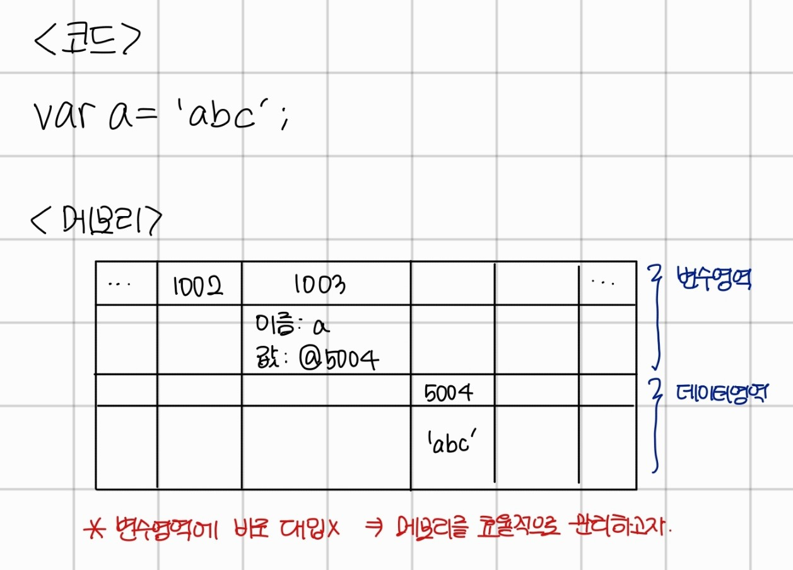
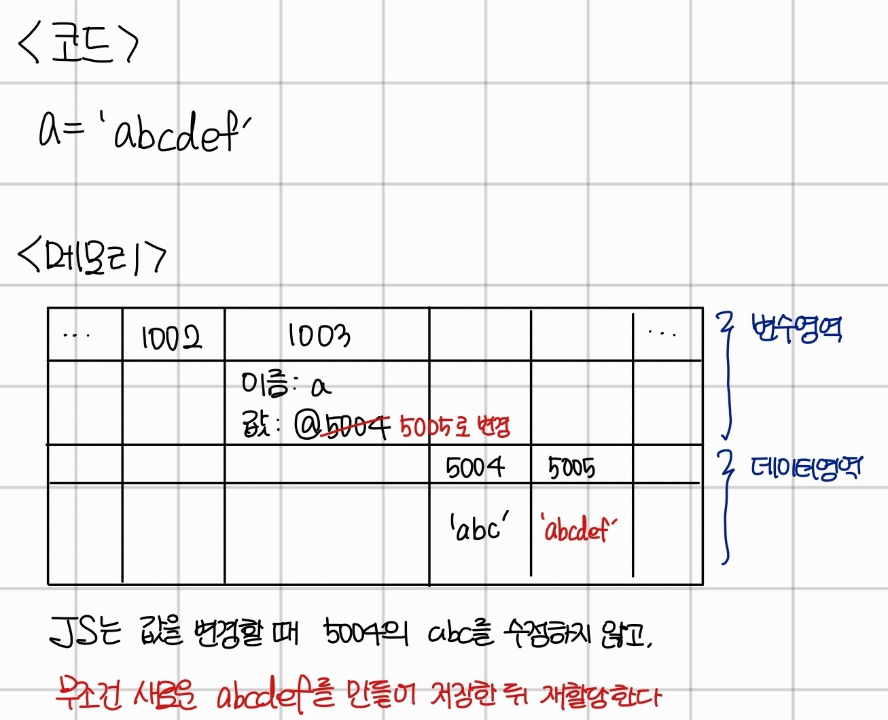
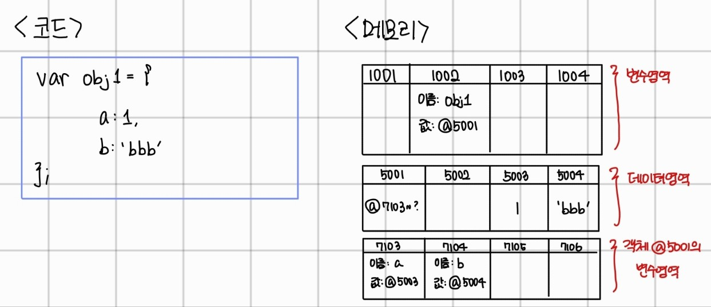
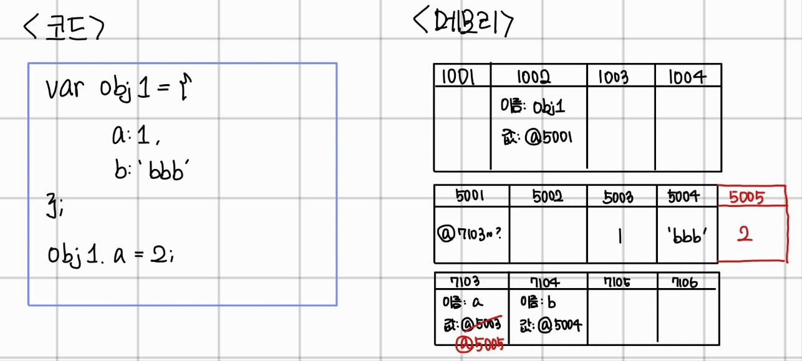
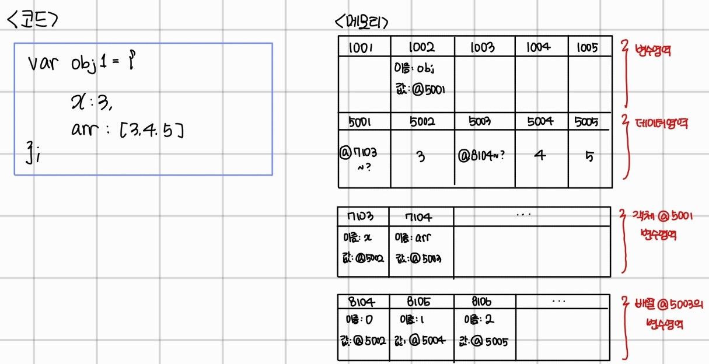

# CoreJavaScript - 데이터 타입

1-1. 데이터 타입의 종류

1. 자바스크립트에는 **기본형 데이터 타입**과, **참조형 데이터 타입**이 존재한다.
2. 기본형 데이터 타입은 값이 담긴 주솟값을 바로 복제한다.
3. 참조형 데이터 타입은 값이 담긴 주솟값들로 이루어진 묶음을 가리키는 주솟값을 복제한다.

<br />

1-2. 데이터 타입에 관한 배경지식

1. 메모리와 데이터

   - 비트: 0또는 1만 표현할 수 있는 메모리 조각
   - 비트의 단점: 비트 단위로 위치를 파악하는 것은 너무 어렵다.
   - 대안책: 문제가 발생하지 않을 정도의 공간을 묶은 단위를 선정 -> **바이트** 탄생

   **모든 데이터는 바이트 단위의 식별자(=메모리 주솟값)을 통해 서로 구분과 연결이 가능해졌다.**

2. 식별자와 변수
   - 변수: 변할 수 있는 무언가(=데이터)
   - 식별자: 변수의 이름(=변수명)

<br />

1-3. 변수 선언과 데이터 할당

- 자바스크립트 변수 할당 예제 1 

  자바 스크립트는 변수영역과 데이터영역을 구분하여 정보를 저장한다.

  문자열을 변경하여 길이를 늘려야 할 경우, 데이터 영역에선 뒤에 이어붙이기만 하면 되므로 편리하기 때문이다.

<br />

- 자바스크립트 변수 할당 예제 2 

  자바스크립트는 기존 변수에 새로운 데이터를 할당할 때, 새로운 데이터를 위한 영역을 만든다.

  그리고 이 데이터 영역의 주솟값을 변수에 다시 연결시켜준다.

  이 방식의 장점은 중복된 데이터에 대한 처리 효율이 높다는 점이다.

  만약 변수가 500개 있고, 각 변수에 8을 대입해야 하는 상황이라면 500\*8, 즉 4000바이트를 사용해야 한다.

  위의 방법처럼 8을 하나의 공간에 저장한뒤 변수에 주소만 연결한다면 500\*2(주소공간) + 8(숫자) 으로 총 1008 바이트만으로도 표현이 가능하다.

<br />

1-4. 기본형 데이터와 참조형 데이터

1. 불변값

   - 변수vs상수

     -> **변수 영역 메모리**의 변경 가능성이 기준이다.

   - 불변값vs상수

     -> **데이터 영역 메모리**의 변경 가능성이 기준이다.

2. 불변값

   - 예제 코드

   ```javascript
   //1번
   var a = 'abc';
   a = a + 'def';

   //2번
   var b = 5;
   var c = 5;

   //3번
   b = 7;
   ```

   - 1번: 기존 'abc'는 변하지 않고, 'abcdef' 를 만들어 해당 데이터의 주소를 a와 연결한다.

   - 2번: 컴퓨터는 5를 데이터 영역에서 찾은 뒤 없으면 공간을 만들어 b에게 연결한다. 이후 c는 데이터 영역에 5가 있기 때문에 b에 연결한 주솟값과 같은 값이 연결된다.

   - 3번: 컴퓨터는 7을 데이터 영역에서 찾은 뒤 없으면 공간을 만들어 b에게 연결, 만약 있다면 바로 연결한다.

   - 결론: 5와 7 모두 다른 값으로 변경되지 않는다.

   - 기본형 데이터는 모두 불변값이다.

   - **기본형 데이터: 숫자, 문자열, boolean, null, undefined, Symbol**

<br />

3. 가변값

   - 기본형 데이터는 모두 불변값이지만, 그렇다고 참조형 데이터가 모두 가변값은 아니다.

   - 참조형 데이터 할당 예제 

     obj1 이라는 변수를 위한 공간 (1002)을 확보, 5001번부터 주소를 연결

     5003과 5004에 a와 b가 갖는 값을 저장

     7103, 7104에 5003과 5004를 연결

     -> **객체(obj1)을 위한 변수 영역이 별도로 존재한다. 데이터 영역에 저장된 값은 모두 불변값이지만, 변수에는 다른 값을 얼마든지 대입할 수 있기 때문에 가변값이라 부른다.**

   <br />

   - 참조형 데이터의 프로퍼티 재할당 

     객체 obj1 이 가리키는 주소는 5001로 변하지 않았다.

     즉, 새로운 객체가 만들어진 것이 아닌, 객체 내부의 값만 바뀌었다.

     **불변값은 값을 바꿀 때 새로운 객체를 만들고 이 주소를 연결해주어야만 바뀌었다. 즉, 기존값을 변경할 수 없었다. 그러나 가변값은 기존 객체 내부의 값을 바꿀 수 있는 것이다.**

    <br />

   - 중첩된 참조형 데이터의 프로퍼티 할당 

     - 이 상태에서 obj1.arr[0]을 검색한다면

       obj 위치를 찾음(1002) -> 연결된 주소 5001로 이동 -> 연결된 주소 7103으로 이동 -> 연결된 주소 5003으로 이동 -> 연결된 주소 8104로 이동 -> 인덱스 0에 해당하는 주소이므로 반환

     - 이 상태에서 obj1.arr='str'을 실행한다면

       새로운 데이터공간에 str을 저장한 뒤, 해당 주소를 7104에 연결한다.

    <br />

   - 가비지 컬렉터

     위처럼 arr에 'str'을 저장하게 되면 arr이 연결된 배열 공간 8104~ 와 해당 주소가 연결된 5003은 참조 카운트가 0이 된다.

     참조 카운트가 0인 메모리 주소는 가비지 컬렉터의 수거 대상이 된다.

<br />

1-5. 불변 객체
<br />

1-6. undefined 와 null
<br />

1-7. 정리
